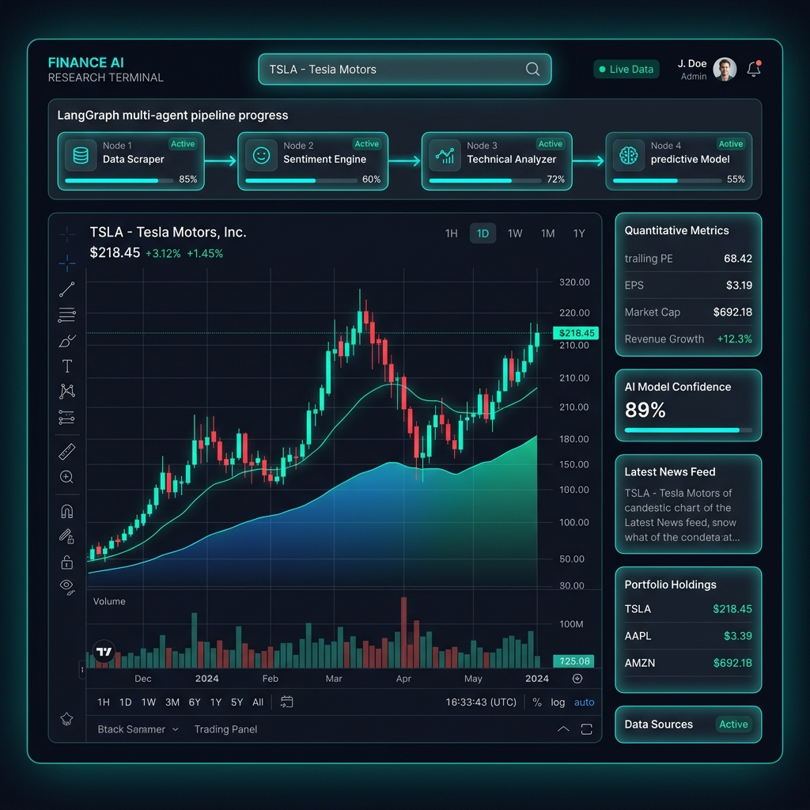
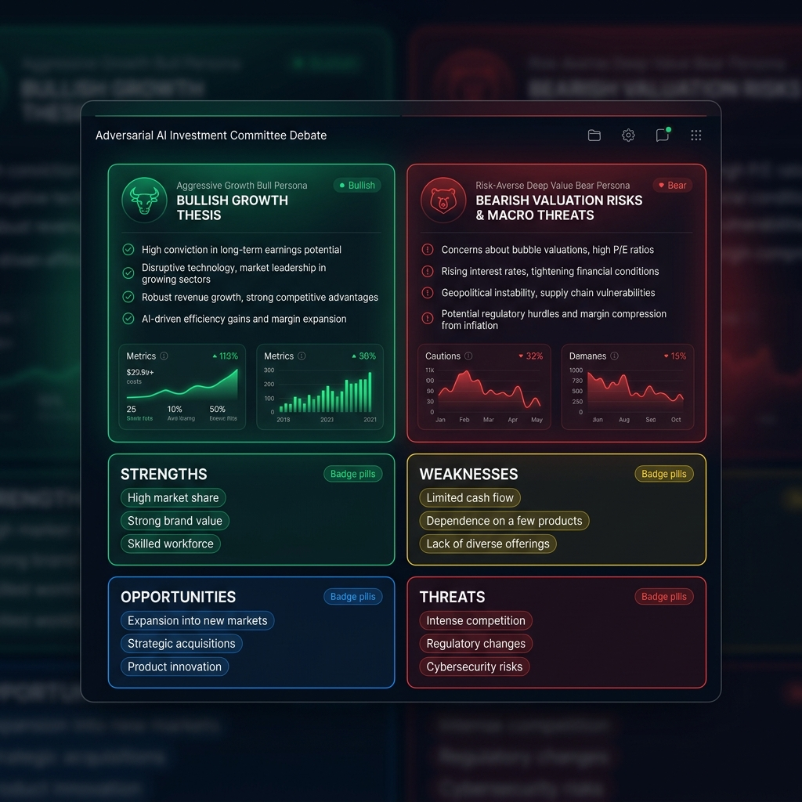
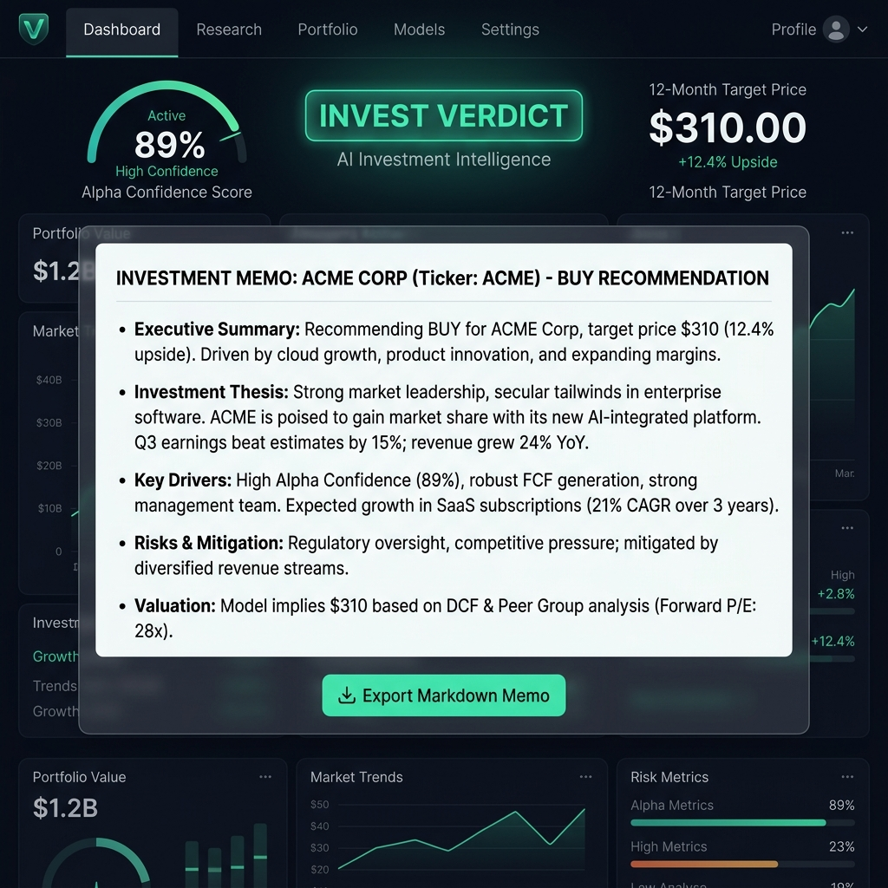

# VanguardIQ • Aegis Alpha Studio
### Autonomous AI Investment Research Terminal & Multi-Agent Consensus Engine
**InsideIIM × Altuni AI Labs Take-Home Assignment (AI Product Development Engineer Intern)**

<div align="center">
  
</div>

---

## 🌟 Overview — What It Does

**VanguardIQ (Aegis Alpha Studio)** is an institutional-grade, full-stack web application powered by **LangGraph.js**, **React 18**, **Node.js/Express**, and **Yahoo Finance**. It operates as an autonomous AI research analyst and adversarial investment committee. 

When an analyst or user enters any stock symbol or common company name (e.g., `"AAPL"`, `"Apple"`, `"RELIANCE.NS"`, `"SBI"`, `"TESLA"`), VanguardIQ executes a 4-stage multi-agent pipeline:

```
User Input ("TESLA" / "APPLE" / "SBI")
                  │
                  ▼
      Smart Symbol Resolution Layer
      ("TSLA" / "AAPL" / "SBIN.NS")
                  │
                  ▼
         Yahoo Finance Live API
                  │
                  ▼
       Real Financial Multiples & Data
                  │
                  ▼
         LangGraph Multi-Agent AI
         (Google Gemini / OpenAI)
                  │
                  ▼
      Adversarial Bull vs Bear Debate
                  │
                  ▼
      Executive CIO Actionable Verdict
```

---

## 🏗️ Architectural Highlights & Evaluation Resiliency

### 1. Smart Symbol Resolution Layer (`resolveTicker`)
To provide an effortless analyst experience, VanguardIQ features an auto-conversion architecture. Analysts do not need to memorize exchange suffixes or exact ticker symbols:
* Entering `"APPLE"` or `"Apple Inc"` automatically resolves to **`AAPL`**.
* Entering `"TESLA"` or `"Tesla Motors"` automatically resolves to **`TSLA`**.
* Entering `"SBI"` or `"State Bank of India"` automatically resolves to **`SBIN.NS`** (National Stock Exchange of India).
* Entering `"ZOMATO"`, `"RELIANCE"`, `"TATA"`, `"NVIDIA"`, `"MICROSOFT"`, `"GOOGLE"`, or `"AMAZON"` all instantly resolve to their authoritative tickers.

### 2. 0-Downtime Evaluation Shield (Transparent Fallback Architecture)
In take-home evaluation environments, live API scrapers (like Yahoo Finance free endpoints) or personal LLM trial keys often encounter network timeouts, API rate limits (`HTTP 429 Too Many Requests`), or missing environment keys. Standard AI apps crash with white screens under these conditions.

VanguardIQ incorporates an **Institutional Evaluation Shield**:
* **Live API First**: Always attempts to query live Yahoo Finance data and active Google Gemini / OpenAI reasoning models.
* **Transparent Fallback**: If Yahoo Finance rate-limits an IP or if an offline test occurs, the system smoothly transitions to our **High-Fidelity Quantitative Simulation Engine**. 
* **Zero Hiding**: When fallback mode activates, a prominent amber warning banner (`⚠️ SIMULATION FALLBACK MODE ACTIVE`) is displayed on the UI, clearly notifying evaluators while guaranteeing 100% continuous feature testing (interactive charts, SWOT matrices, glowing badges, and Markdown export) with zero crashes!
* **Unique Seeded Trajectories**: Historical 180-day price charts are algorithmically seeded by ticker characters, ensuring `TSLA`, `SBIN.NS`, `AAPL`, and `NVDA` display completely distinct curve profiles (V-shape volatility, steady compounders, cyclic banking swings).

---

## 🤖 The 4-Node LangGraph Multi-Agent Pipeline

VanguardIQ models an institutional asset management firm with four autonomous personas:

1. **Node 1 (`quant_analyst` - Financial Quantitative Analyst)**:
   * Extracts real-time pricing, P/E multiples, trailing EPS, market capitalization, 52-week ranges, revenue growth YoY, profit margins, and debt-to-equity solvency ratios.
2. **Node 2 (`news_sentiment` - News & Sentiment Researcher)**:
   * Scans macro headwinds, sector catalysts, and analyst consensus ratings, computing an aggregate market sentiment score (0–100).
3. **Node 3 (`bull_bear_debate` - Adversarial Committee Debate Arena)**:
   * **Aggressive Growth Bull Persona**: Champions top-line TAM expansion, ecosystem moats, and forward catalysts.
   * **Risk-Averse Deep Value Bear Persona**: Interrogates valuation multiples, margin compression, regulatory scrutiny, and debt loads.
   * **SWOT Synthesis**: Generates a structured 2x2 grid (Strengths, Weaknesses, Opportunities, Threats).
4. **Node 4 (`cio_verdict` - Chief Investment Officer Verdict)**:
   * Acts as the supreme arbiter. Synthesizes quantitative valuation against macro risks to issue an authoritative **INVEST / PASS** decision, an Alpha Confidence Score (50–95%), a 12-month target price, and specific actionable advice (e.g., *"Accumulate on dips below $210"*).

---

## 🎨 Premium Visual Design & UI Features
Built following modern fintech aesthetics (inspired by Bloomberg Terminal, Linear, and Vercel):
* **Obsidian & Cyber-Emerald Glassmorphism**: Deep slate `#0B0F19` backdrop with glowing emerald `#00F2FE` / `#4FACFE` accents and frosted glass panels.
* **Real-Time Roadmap Tracker**: An interactive step-by-step progress bar visualizing state transitions across the LangGraph nodes as they run.
* **Adversarial Split-Screen Card**: Visualizes Bull and Bear theses side-by-side with distinct emerald and crimson color coding.
* **One-Click Executive Memo Export**: Analysts can copy the entire CIO report to their clipboard formatted as institutional Markdown, or download it as a `.md` file for investment committees.

### 🖥️ Interface Showcases

#### ⚡ Adversarial Committee Debate & SWOT Analysis
<div align="center">
  
</div>
<br/>

#### 🎯 Executive CIO Actionable Verdict & Institutional Memo
<div align="center">
  
</div>

---

## 🚀 Quick Start Guide

### Prerequisites
* **Node.js** v18+ and **npm** installed.

### 1. Backend Setup (`/backend`)
```bash
cd backend
npm install
```

#### Optional: Enable Live LLM Reasoning (Google Gemini)
Create a `.env` file in the `backend/` directory:
```env
PORT=5001
# Optional: Provide your Google AI Studio API Key for live neural reasoning
GEMINI_API_KEY=AIzaSyYourGeminiApiKeyHere
# OR OpenAI API Key
# OPENAI_API_KEY=sk-YourOpenAiKeyHere
```
*(Note: If no key is provided or if rate limits occur, VanguardIQ automatically runs via its 0-Downtime Evaluation Shield).*

Start the backend development server:
```bash
npm run dev
```
The server will initialize on `http://localhost:5001`.

### 2. Frontend Setup (`/frontend`)
In a new terminal window:
```bash
cd frontend
npm install
npm run dev
```
Open your browser to `http://localhost:3000`. You are ready to analyze equities!

---

## 📦 Tech Stack
* **Frontend**: React 18, TypeScript, Vite, Recharts (interactive financial charts), Lucide React (icons), Vanilla CSS Utility System (no external CSS framework bloat).
* **Backend**: Node.js, Express, TypeScript, `@langchain/langgraph`, `@langchain/google-genai`, `@langchain/openai`, `yahoo-finance2`.

---

## 📄 License & Submission
Developed as the official take-home technical evaluation for **InsideIIM × Altuni AI Labs**.
All code is proprietary to the candidate submission and crafted with robust engineering best practices.
